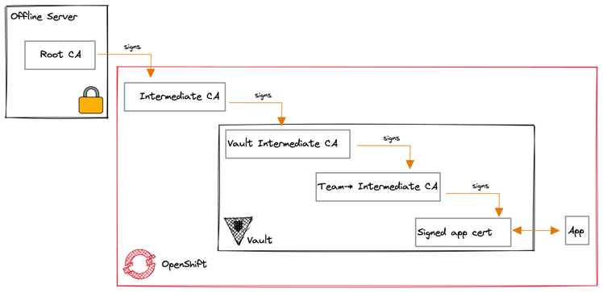
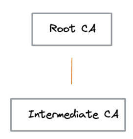
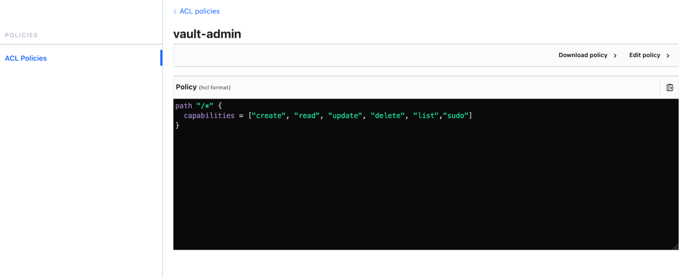
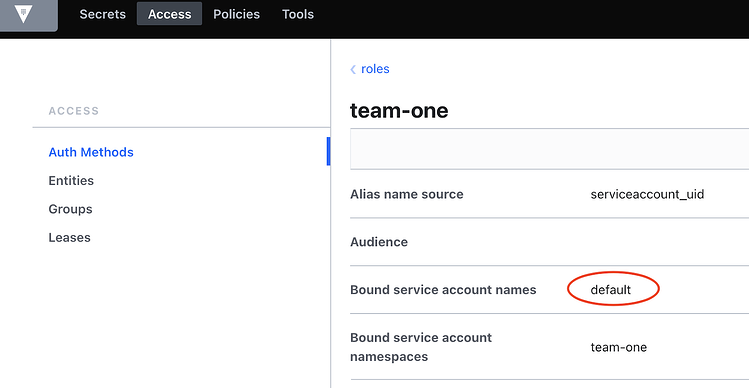

# Cómo proteger las aplicaciones nativas de la nube con HashiCorp Vault y Cert Manager

Cuando hablamos de seguridad en las organizaciones, generalmente nos referimos a la prevención de la pérdida de datos, o también a la automatización e integración segura de aplicaciones. Para lograr esto, es necesario saber quién está haciendo qué con qué activos, y ahí es donde entra en juego la gestión de identidades, HashiCorp Vault. El "quién" en la ecuación se vuelve muy importante. 

Los certificados emitidos correctamente permiten la seguridad de extremo a extremo a través de una cadena de identidades confiable (PKI). Resulta que la emisión de certificados pasa ser una tarea cotidina y repetitida dado que este proceso debe acompañar la cedencia del despliegue de aplicaciones, es decir, esta gestion debe ser tan ágil como el propio proceso de despligue, por lo tanto se requiere automatización más allá de la gestión de identidades.

Como ocurre con la mayoría de los objetivos de seguridad, suele haber fricción entre el requisito de hacer que las cosas sean seguras y tratar de hacer el trabajo real. El arte aquí es equilibrar los dos requisitos en conflicto, una forma de reducir la carga del desarrollador e infraestructura es automatizar tanto como sea posible.

En este articulo, se probará cómo se puede usar OpenShift junto con Cert Manager y HashiCorp Vault para lograr un proceso automatizado y reproducible para aumentar la seguridad de las aplicaciones.

Desde el punto de vista de infraestructura y seguridad informatica, este enfoque automatizado es fácil de usar y también está instrumentado para que sepamos qué está pasando y podamos tomar las medidas adecuadas si falla. 
#

## Autoridad Certificante o Certificate Authority (CA)

El propósito de una autoridad de certificación (CA) es validar y emitir certificados. Una CA puede ser una entidad u organización de terceros que ejecuta su propio proveedor para emitir certificados digitales.

Una CA intermedia es una CA firmada por una CA superior (por ejemplo, una root CA u otra CA intermedia) y firma otras CA (por ejemplo, otra CA intermedia o subordinada).

Si existe una CA intermedia, se coloca en medio de una cadena de confianza entre el Root CA y el certificado del suscriptor que emite las CA subordinadas. Entonces, ¿no usar una Root CA directamente?

Por lo general, la Root CA  no firma certificados de servidor o cliente directamente. La Root CA se usa solo para crear una o más CA intermedias. El uso de una CA intermedia es principalmente por motivos de seguridad y la Root CA está alojada en otro lugar, en un lugar seguro; fuera de línea y se usa con la menor frecuencia posible.

Por lo tanto, lo mejor es no exponer la Root CA dentro de los entornos de cliente y, en su lugar, emitir una CA intermedia de vida más corta. El uso de CA intermedia también se alinea con las mejores prácticas de la industria.
#

## Jerarquía de CA

En grandes organizaciones, lo ideal seria delegar la emision de certificados a distintas autoridades de certificacion para asi tener un control granular apropiado para cada CA.

Por ejemplo,  la cantidad de certificados puede ser demasiado grande para que una sola CA realice un seguimiento efectivo de los certificados que ha emitido;  o cada departamento dentro de la organizacion  puede tener diferentes políticas y reglas, como períodos de validez; o puede ser importante diferenciar los certificados para la comunicación interna o externa.

El estándar X.509 incluye una plantilla para configurar una jerarquía de CA:

- Root CA aislada en un servidor offline para firmar una CA intermedia primaria.
- CA intermedia a nivel del cluster que permite firmar otra CA intermedia para vault en su rol de issuer
- CA intermedia para Vault en su rol de issuer que emite una ultima CA a nivel granular de cada aplicaion.
- CA intermedia a nivel de aplicacion  que permite la firma de certificados que seran consumidos por las aplicaciones.
- Certificado disponibilizado para las aplicaciones.

#

# Instalación

## Administrador de certificados
El operador [Cert Manager](https://cert-manager.io/) provisto por JetStack pero es una herramienta para Kubernetes y Openshift que automatiza la gestión de certificados en entornos nativos de la nube. 

>Este operador a partir de la version de Openshift 4.10 es provisto y soportado  por Red Hat de manera oficial.

El principio se basa en que estas plataformas puedan proporcionar certificados X.509 de forma dinamica trabajando a los emisores (Issuers) como si fueran objetos de Kubernetes.
Proporciona herramientas fáciles de usar para administrar certificados, incluidos "certificados como servicio" para habilitar de forma segura a los desarrolladores y aplicaciones que trabajan dentro de un clúster una API estandarizada para interactuar con múltiples autoridades de certificación (CA). Esto tambien brinda a los equipos de seguridad informatica la confianza para permitir que los desarrolladores administren los certificados en forma autonoma.

[Cert Manager](https://cert-manager.io/) integra una variedad de Emisores, tanto Emisores públicos populares como Emisores privados, y se asegurará de que los certificados sean válidos y estén actualizados. Es decir, intentará renovar los certificados antes de su vencimiento.

#

## Crear la cadena de CA
Comencemos desde cero y simulemos la creación de nuestra propia autoridad de certificación (CA) y la construcción de la jerarquía de la misma.

Vamos a crear el root CA certificate-key pair utilizando el programa OpenSSL.



Primero, nos dirigimos a un directorio para el cual se crearán los certificados.
Alli definiremos esa ruta como una variable de entorno que reutilizaremos luego.
```sh
export CERT_ROOT=$(pwd)
```
Defina la estructura del directorio:
```sh
mkdir  -p ${CERT_ROOT} /{root,intermediate} 
```
Genere la CA certificate-key pair:
```sh
cd ${CERT_ROOT} /root/ openssl genrsa -out ca.key 2048 
touch index.txt 
echo 1000 > serial 
mkdir -p newcerts 
```

Defina el archivo openssl.cnf:
```sh
cat <<EOF > openssl.cnf
[ ca ]
default_ca = CA_default

[ CA_default ]
# Directory and file locations.
dir               = ${CERT_ROOT}/root
certs             = \$dir/certs
crl_dir           = \$dir/crl
new_certs_dir     = \$dir/newcerts
database          = \$dir/index.txt
serial            = \$dir/serial
RANDFILE          = \$dir/private/.rand

# The root key and root certificate.
private_key       = \$dir/ca.key
certificate       = \$dir/ca.crt

# For certificate revocation lists.
crlnumber         = \$dir/crlnumber
crl               = \$dir/crl/ca.crl
crl_extensions    = crl_ext
default_crl_days  = 30

# SHA-1 is deprecated, so use SHA-2 instead.
default_md        = sha256

name_opt          = ca_default
cert_opt          = ca_default
default_days      = 375
preserve          = no

policy            = policy_strict

[ policy_strict ]
# The root CA should only sign intermediate certificates that match.
countryName               = match
stateOrProvinceName       = optional
organizationName          = optional
organizationalUnitName    = optional
commonName                = supplied
emailAddress              = optional

[ v3_intermediate_ca ]
# Extensions for a typical intermediate CA.
subjectKeyIdentifier = hash
authorityKeyIdentifier = keyid:always,issuer
basicConstraints = critical, CA:true, pathlen:1
keyUsage = critical, digitalSignature, cRLSign, keyCertSign

[req_distinguished_name]
countryName = AR
countryName = Country Name
countryName_default = AR
stateOrProvinceName = State or Province Name
stateOrProvinceName_default = BA
localityName= Locality Name
localityName_default = CABA
organizationName= Organization Name
organizationName_default = Semperti
commonName= Company Name
commonName_default = company.io
commonName_max = 64

[req]
distinguished_name = req_distinguished_name
[ v3_ca ]
basicConstraints = critical,CA:TRUE
subjectKeyIdentifier = hash
authorityKeyIdentifier = keyid:always,issuer:always
EOF
```
Generar el certificado:
```sh
openssl req -x509 -new -nodes -key ca.key -sha256 -days 1024 -out ca.crt -extensions v3_ca -config openssl.cnf

You are about to be asked to enter information that will be incorporated
into your certificate request.
What you are about to enter is what is called a Distinguished Name or a DN.
There are quite a few fields but you can leave some blank
For some fields there will be a default value,
If you enter '.', the field will be left blank.
-----

Country Name [AR]:

State or Province Name [BA]:

Locality Name [CABA]:

Organization Name [Semperti]:

Company Name [company.io]:

```

Como se muestra en el resultado anterior, el valor definido en el archivo de configuración openssl.cnf incluye una entrada req_distinguished_name que se utiliza como conjunto de valores predeterminado al generar el certificado. Se pueden utilizar los valores predeterminados o se puede proporcionar un conjunto de valores definido por el usuario.    

Ahora con la root CA, podemos comenzar con el segundo paso de la cadena: la CA intermedia a nivel del cluster.

Generamos la clave privada de CA intermedia:

```sh
cd  ../intermediate 

openssl genrsa -out ca.key 2048
```

Generamos el CSR correspondiente.

```sh
openssl req -new -sha256 -key ca.key -out ca.csr

You are about to be asked to enter information that will be incorporated
into your certificate request.
What you are about to enter is what is called a Distinguished Name or a DN.
There are quite a few fields but you can leave some blank
For some fields there will be a default value,
If you enter '.', the field will be left blank.

-----
Country Name (2 letter code) []:AR
State or Province Name (full name) []:BA
Locality Name (eg, city) []:CABA
Organization Name (eg, company) []:Semperti
Organizational Unit Name (eg, section) []:IT
Common Name (eg, fully qualified host name) []:int.company.io
Email Address []:
Please enter the following 'extra' attributes
to be sent with your certificate request
A challenge password []:
```
> Asegúrese de que el Country Name y el Common Name estén definidos, ya que la política ( policy_strict ) establecida en openssl.cnf requiere un Country Name y Common Name que coincidan.

Creamos el certificado intermedio.

```sh
openssl ca -config ../root/openssl.cnf -extensions v3_intermediate_ca -days 365 -notext -md sha256 -in ca.csr -out ca.crt
...

Certificate is to be certified until May 12 12:52:52 2023 GMT (365 days)

Sign the certificate? [y/n]:y
1 out of 1 certificate requests certified, commit? [y/n]y

Write out database with 1 new entries
Data Base Updated
```

Nuestra CA intermedia a nivel del cluster ya está lista para ser utilizada.
#
## Issuer con Cert Manager
Lo primero que deberá configurar después de haber instalado el *operador de cert-manager* es que se cree un issuer para poder usar luego y emitir certificados.

Los issuers son recursos de Kubernetes representados por las autoridades de certificación (CA) y que pueden generar certificados firmados cumpliendo con las solicitudes de firma de certificados (CSR).

El tipo de issuer más simple es la CA, que hace referencia al secreto TLS de Kubernetes que contiene un certificate-key pair.

Genere certificados SSL para Vault usando Cert Manager.
Antes de poder instalar Vault, los certificados deben aprovisionarse dentro de un namespaces creado desde cero.

Primero, defina namespace donde queremos instalar Vault:

```sh
oc new-project hashicorp
```

Desde el directorio intermediate, creemos el secreto de Kubernetes que contiene el certificado generado anteriormente

```sh
oc create secret tls intermediate --cert=${CERT_ROOT}/intermediate/ca.crt --key=${CERT_ROOT}/intermediate/ca.key -n hashicorp
```

Una vez que se crea el secreto, podemos aplicar un issuer CR de Cert Manager de tipo CA al clúster:

```sh
cat <<EOF | oc apply -f -
apiVersion: cert-manager.io/v1
kind: Issuer
metadata:
  name: int-ca-issuer
spec:
  ca:
    secretName: intermediate
EOF
```

Verifiquemos el estado del issuer para confirmar que se creó correctamente:

```sh
oc get issuer int-ca-emisor

NAME           READY      AGE 
int-ca-emisor  True       5s
```

> NOTA: Este issuer de Cert Manager específico, contiene la CA intermedia que se usa estrictamente para firmar el certificado de Vault únicamente. Ninguna otra aplicación solicitará certificados.

Ahora crearemos un Certificado CR para HashiCorp Vault, pero, primero debemos definir algunas variables que utlizaremos durante todo el proceso:

```sh
export BASE_DOMAIN=$(oc get dns cluster -o jsonpath='{.spec.baseDomain}')
export VAULT_HELM_RELEASE=vault
export VAULT_ROUTE=${VAULT_HELM_RELEASE}.apps.$BASE_DOMAIN
export VAULT_ADDR=https://${VAULT_ROUTE}
export VAULT_SERVICE=${VAULT_HELM_RELEASE}-active.hashicorp.svc
```

Implementamos el certificado:

```sh
cat <<EOF|oc apply -f -
apiVersion: cert-manager.io/v1
kind: Certificate
metadata:
  name: vault-certs
spec:
  secretName: vault-certs
  issuerRef:
    name: int-ca-issuer
    kind: Issuer
  dnsNames: 
  - ${VAULT_ROUTE}
  # Service Active FQDN
  - ${VAULT_SERVICE}
  organization:
  - company.io
EOF
```

> NOTA : El certificado generado debe ser válido tanto para el servicio activo de Vault como para Vault Route.

Una vez que cert-manager detecta la creación del Certificado CR, se generará un certificado SSL en nombre de la CA intermedia interna y se guardará como un secreto TLS de Kubernetes. 

```sh
oc get secret vault-certs

NAME        TYPE              DATA  AGE

vault-certs kubernetes.io/tls 3     12s
```

> NOTA : Los pods de HashiCorp utilizarán este certificado para proteger el puerto 8200 de la API de Vault. Cuando los nodos de Vault se unan al clúster, deberán realizar una API request al nodo activo de Vault (a través del servicio activo de Vault). Sin embargo, más adelante, cuando se configure el clúster de Vault, los nodos se comunicarán a través del puerto de clúster 8201, que está protegido por un certificado generado internamente por el nodo activo de Vault.

#
## HashiCorp Vault

[HashiCorp Vault](https://www.vaultproject.io/) es un sistema de gestión de cifrado y secretos basado en la identidad.

Un secreto es cualquier cosa a la que desee controlar estrictamente el acceso, como claves de cifrado API, contraseñas o certificados.

Vault proporciona servicios de encriptación controlados por métodos de autenticación y autorización. Con la interfaz de usuario, la CLI o la API HTTP de Vault, el acceso a secretos y otros datos confidenciales se puede almacenar y gestionar de forma segura, controlar de forma estricta (restringir) y auditar.

Con el certificado ahora en marcha, es hora de implementar y configurar Vault.

La forma oficial de instalar Hashicorp Vault es usar el [Vault Helm Chart](https://www.vaultproject.io/docs/platform/k8s/helm).

En entornos de producción, se implementa de manera de alta disponibilidad. HashiCorp Vault necesita un backend de almacenamiento subyacente para almacenar los datos y puede confiar en su [almacenamiento integrado](https://www.vaultproject.io/docs/configuration/storage/raft) , que utiliza el algoritmo de consenso [RAFT](https://www.vaultproject.io/docs/configuration/storage/raft).

Cuando se implementa en OpenShift, el almacenamiento integrado es una solución conveniente para almacenar datos, ya que elimina la carga de administrar un componente de almacenamiento adicional para almacenar los datos de Vault.

1. Cree un directorio de trabajo para la instalación de Vault.

```sh
mkdir -p vault 
cd vault/
```

2. Configure el repositorio de Helm:

```sh
helm repo add hashicorp https://helm.releases.hashicorp.com
helm repo update
```

3. Defina el archivo Helmvalues.yaml que configurará un entorno de Vault de alta disponibilidad con almacenamiento Raft:

```sh
cat <<EOF > values.yaml
global:
  tlsDisable: false
  openshift: true
injector:
  image:
    repository: "registry.connect.redhat.com/hashicorp/vault-k8s"
    tag: "0.14.2-ubi"
  agentImage:
    repository: "registry.connect.redhat.com/hashicorp/vault"
    tag: "1.9.6-ubi"
ui:
  enabled: true
server:
  image:
    repository: "registry.connect.redhat.com/hashicorp/vault"
    tag: "1.9.6-ubi"
  route:
    enabled: true
    host:
  extraEnvironmentVars:
    VAULT_CACERT: "/etc/vault-tls/vault-certs/ca.crt"
    VAULT_TLS_SERVER_NAME:
  standalone:
    enabled: false
  auditStorage:
    enabled: true
    size: 15Gi
  extraVolumes:
    - type: "secret"
      name: "vault-certs"
      path: "/etc/vault-tls"
  ha:
    enabled: true
    raft:
      enabled: true
      setNodeId: true
      config: |
        ui = true
        listener "tcp" {
          address = "[::]:8200"
          cluster_address = "[::]:8201"
          tls_cert_file = "/etc/vault-tls/vault-certs/tls.crt"
          tls_key_file = "/etc/vault-tls/vault-certs/tls.key"
          tls_client_ca_file = "/etc/vault-tls/vault-certs/ca.crt"
        }
        storage "raft" {
          path = "/vault/data"
          retry_join {
            leader_api_addr = "https://vault-active.hashicorp.svc:8200"
            leader_ca_cert_file = "/etc/vault-tls/vault-certs/ca.crt"
          }
        }
        log_level = "debug"
        service_registration "kubernetes" {}
  service:
    enabled: true
EOF
```

4. Instale el chart de Helm para Vault usando los valores configurados previamente:

```sh
helm install vault hashicorp/vault -f values.yaml \
    --set server.route.host=$VAULT_ROUTE \
    --set server.extraEnvironmentVars.VAULT_TLS_SERVER_NAME=$VAULT_ROUTE \
    --wait \
    -n hashicorp
```
5. Inicialice Vault y guarde la clave y el token generados:

```sh
oc -n hashicorp exec -ti vault-0 -- vault operator init -key-threshold=1 -key-shares=1

Unseal Key 1: somekey

Initial Root Token: s.sometoken

```

6. Quite el sello de todas las instancias de Vault porque inician en estado "sealed"  :

```sh
oc -n hashicorp exec -ti vault-0 -- vault operator unseal

Unseal Key (will be hidden):

oc -n hashicorp exec -ti vault-1 -- vault operator unseal

Unseal Key (will be hidden):

oc -n hashicorp exec -ti vault-2 -- vault operator unseal

Unseal Key (will be hidden):

```

7. Ahora que Vault esta en estado "unseal", verifique que el almacenamiento [RAFT] tenga un "leader" y dos "follower":

```sh
oc -n hashicorp rsh vault-0

vault login

Token (will be hidden):

vault operator raft list-peers

vault operator raft list-peers
Node       Address                        State       Voter
----       -------                        -----       -----
vault-0    vault-0.vault-internal:8201    leader      true
vault-1    vault-1.vault-internal:8201    follower    true
vault-2    vault-2.vault-internal:8201    follower    true
```

8. Verifique el acceso desde la interfaz de usuario de Vault. En OpenShift Web Console, haga clic en Redes → Rutas y haga clic en la ruta de Vault .
[vault route](images/vault-ui.png)

9. Para autenticarse, use el token root generado antes por el comando de inicialización.

#
## Integrar Vault con OpenShift


En este punto, Vault está listo para integrarse en la plataforma OpenShift.

### Método de autenticación de Kubernetes

El método de autenticación de Kubernetes se puede usar para autenticarse con Vault mediante un Service Account (SA) token de Kubernetes. El token de la SA de un pod se monta automáticamente dentro de un pod en /var/run/secrets/kubernetes.io/serviceaccount/token y se envía a Vault para su autenticación.    

Vault, como todos los pods en Kubernetes, está configurado con una cuenta de servicio que tiene permisos para acceder a la API TokenReview . Esta SA se puede usar para realizar request  autenticadas a Kubernetes para verificar los tokens de las SA de los pods que desean conectarse a Vault para obtener secretos.  

### Configuración de Vault para OpenShift

#### Conectando Vault

La conexión a Vault se puede inicializar con [las variables de entorno estándar de Vault] que se aplican al pod de operador de configuración de Vault. Consulte la [documentación de OLM] sobre cómo pasar variables de entorno a través de una suscripción. Las variables que se leen en la inicialización del cliente se enumeran [aquí].

1. Descargue e instale el [cliente de Vault] siguiendo las instrucciones.

En el siguiente ejemplo se enumeran los comandos para instalarlo en ambientes Linux RHEL/Centos
```sh
sudo yum install -y yum-utils
sudo yum-config-manager --add-repo https://rpm.releases.hashicorp.com/RHEL/hashicorp.repo
sudo yum -y install vault

export BASE_DOMAIN=$(oc get dns cluster -o jsonpath='{.spec.baseDomain}')
export VAULT_HELM_RELEASE=vault
export VAULT_ROUTE=${VAULT_HELM_RELEASE}.apps.$BASE_DOMAIN
export VAULT_ROUTE_DR=${VAULT_HELM_RELEASE}-dr.apps.$BASE_DOMAIN
export VAULT_ADDR=https://${VAULT_ROUTE}
export VAULT_SERVICE=${VAULT_HELM_RELEASE}-active.hashicorp.svc
export VAULT_SKIP_VERIFY="true"
```
2. Inicie sesión en Vault con el **token root** que se mostró anteriormente al inicializar Vault:

```sh
vault login -tls-skip-verify

Token (will be hidden):

Success! You are now authenticated.
```
3. Cree una [política de administrador]: 

```sh
cat <<EOF > ./policy.hcl
path "/*" {
  capabilities = ["create", "read", "update", "delete", "list","sudo"]
}
EOF

vault policy -tls-skip-verify write vault-admin ./policy.hcl
```


> NOTA: esta política es intencionalmente amplia para permitir probar cualquier accion en Vault. En un escenario productivo, esta política tendría un alcance reducido. 

4. No movemos al proyecto de *cert-manager* y creamos una cuenta de servicio para autenticar con Vault. A traves de esta cuenta administraremos y consumiremos secretos de Vault.

```sh
oc project openshift-cert-manager
oc create sa vault-auth -n openshift-cert-manager
```

5. Habilitamos el método de autenticación de Kubernetes obteniendo primero los detalles relacionados con la API de Kubernetes, incluido el certificado:
   
```sh
secret=`oc describe sa vault-auth -n openshift-cert-manager | grep 'Tokens:' | awk '{print $2}'`
token=`oc describe secret $secret | grep 'token:' | awk '{print $2}'`
pod=`oc get pods -n hashicorp | grep vault | awk '{print $1; exit}'`
oc exec $pod -n hashicorp -- cat /var/run/secrets/kubernetes.io/serviceaccount/ca.crt >  ca.crt

vault auth enable kubernetes

vault write -tls-skip-verify auth/kubernetes/config token_reviewer_jwt=$token kubernetes_host=https://kubernetes.default.svc:443 kubernetes_ca_cert=@ca.crt

```
6. Crear un Rol y asignarlo a la política previamente creada
   
```sh
vault write -tls-skip-verify auth/kubernetes/role/vault-admin bound_service_account_names=vault-auth bound_service_account_namespaces=* policies=vault-admin ttl=24h

```
Verifique el método de autenticación de kubernetes creado recientemente desde Vault UI → Access → AuthMethods.
   


7. Agregue la función de revisión de tokens para la SA del controller-manager para que lo utilice Vault:
    
```sh
oc adm policy add-cluster-role-to-user system:auth-delegator -z vault-auth

```
#
## Vault PKI Secrets Engine.

El [Vault PKI Secrets Engine]I genera certificados X.509 dinámicos, sin requerir todas las acciones manuales.  

Los mecanismos de autenticación y autorización integrados de Vault proporcionan la funcionalidad de verificación necesaria.


Como se ve en el diagrama anterior, hay varios pasos para permitir que Vault sea un administrador de certificados en OpenShift. Estos pasos se detallan a continuación:

Vault:

1. Habilitar el [Vault Kubernetes Auth] en Vault.

2. Autorizar Vault SA en k8s para la revisión de tokens.

3. Habilitar [Vault PKI Secrets Engine].

4. Configure el rol de PKI en Vault.

5. Configure la política de PKI en Vault.

6. Autorizar/Obligar al emisor SA a usar (política) el rol de PKI.

Cert-Manager:
1. Cree el issuer en el namespace de la aplicación con issuer SA.

2. [Cert Manager] valida las credenciales del emisor contra Vault.


Jerarquia CA:

Es hora de crear la jerarquía de la cadena de CA con una root CA fuera de línea y CA intermedia para Vault para cada namespaces de cada aplicación.

Tener una CA intermedia dedicada por organización o equipo puede aumentar la seguridad y obtener un mayor control sobre la cadena de confianza en su ecosistema, lo que le permite confiar solo en los certificados emitidos por su modelo de confianza.


### PKI Intermediate

1. Cree un SecretEngineMount intermediate : 
```sh
vault secrets enable -path=pki/intermediate -max-lease-ttl=8760h pki

```
Verifique desde la interfaz de usuario de Vault → Secretos que creó el motor secreto de PKI.


2. Configure un PKISecretEngineConfig intermedio : 

```sh
vault write pki/intermediate/config/urls issuing_certificates="https://${VAULT_ROUTE}/v1/pki/intermediate/ca" crl_distribution_points="https://${VAULT_ROUTE}/v1/pki/intermediate/crl"

```

En GUI Crear CSR con:
	  
CA certificate:
	CA Type: Intermediate
	Type: Internal
	common_name= vault.int.company.io
	Options> OU: SI
	Address Options:          
	Country: AR
	Locality/City: CABA
	Province/State: BA

Descargar el CSR para firmarlo offline. Este paso se realiza una sola vez.

3. Leemos, validamos y firmamos el CSR con la CA Root offline:

```sh
openssl req -in pki_int.csr -noout -text

openssl ca -config ${CERT_ROOT}/root/openssl.cnf -extensions v3_intermediate_ca -days 365 -notext -md sha256 -in pki_int.csr -out signed_certificate_int.pem

openssl x509 -in signed_certificate_int.pem -text -noout
```
4. Imprimimos, copiamos y pegamos el CRT via GUI

```sh
cat signed_certificate_int.pem
```

> Verifique desde Vault UI → Secret → pki/intermediate el certificado firmado.


### PKI Intermediate por Namespace

Configuracion de la PKI para el app demo:

En este punto, es hora de configurar la PKI para namespace de la aplicación demo; para este ejemplo, configuramos el namespace team-one.  

1. Cree "AuthEngineMount" para definir un [authentication engine endpoint]:
```sh

```
Verifique desde la interfaz de usuario de Vault → Acceso → AuthMethods.


2. Cree "KubernentesAuthEngineConfig" para configurar el montaje del motor de autenticación para que apunte a un extremo de la API maestra de Kubernetes específico: 
     
```sh

```
3. Cree KubernetesAuthEngineRole , que configura todas las SA predeterminadas en el namespace de la aplicación:

```sh

```
Verifique desde la interfaz de usuario de Vault → Acceso → app-kubernetes/team-one → Roles.


4. Defina la política para otorgar el acceso correcto al motor PKI:

```sh

```
5. Ahora, cree el namespace de la aplicación team-one que puede aprovechar los recursos que configuramos anteriormente:  
```sh

```
6. Cree el "SecretEngineMount" de tipo PKI en el namespace de la aplicación team-one :

```sh

```

Verificar desde la interfaz de usuario de Vault → Secretos 


1. Genere el CA intermedia a nivel de aplicacion firmado por la pki interna de Vault/ CA intermedia:

```sh

```

Verifique desde Vault UI → Secret → app-pki/team-one el certificado firmado.


1. Configure el rol de PKI:


```sh

```
Verifique desde la interfaz de usuario de Vault → Secreto → app-pki/team-one → Roles 


#
## Implentacion de aplicacion Demo

Para demostrar la funcionalidad de un extremo a otro, se puede implementar una aplicación demo basada en el web server apache con certificados proporcionados por cert-manager y la integración de Hashicorp Vault.


Como podemos ver en el diagrama anterior, hay varios pasos para solicitar certificados de Hashicorp Vault que pueden ser consumidos por las aplicaciones.

**En OpenShift:**

El issuer de cert-manager es la interfaz entre los certificados y HashiCorp Vault. Definimos la ruta donde se crearán los certificados y la autenticación de Kubernetes para acceder al rol de "team-one" de PKI.

Vamos a crear un issuer a nivel del namespace, que es la mejor forma de aislar certificados. 
Por lo tanto, no es posible emitir certificados desde un issuer en un namespace diferente:

1.1 Obtenga HashiCorp Vault CA Bundle y el token de SA predeterminado de team-one.
```sh

```
1.2 Crear issuer de cert-manager.
```sh

```
Como podemos observar en el ejemplo de código anterior, la autenticación se realiza mediante la SA predeterminada del namespace.

Esto se configura en la interfaz de usuario de Vault → Acceso → Métodos de autenticación → app-kubernetes/team-one → Roles → team-one de la siguiente manera:  


[//]: # (links references)

[Cert Manager]: <https://cert-manager.io/>

[HashiCorp Vault]: <https://www.vaultproject.io/docs/what-is-vault>

[Vault Helm Chart]: <https://github.com/hashicorp/vault-helm>

[almacenamiento integrado]: <https://www.vaultproject.io/docs/concepts/integrated-storage>

[RAFT]: <https://raft.github.io/>

[las variables de entorno estándar de Vault]:<https://www.vaultproject.io/docs/commands#environment-variables>

[documentación de OLM]:<https://github.com/operator-framework/operator-lifecycle-manager/blob/master/doc/design/subscription-config.md#env>

[aquí]:<https://github.com/hashicorp/vault/blob/14101f866414d2ed7850648b465c746ac8fda621/api/client.go#L35>

[cliente de Vault]:<https://www.vaultproject.io/downloads>

[política de administrador]:<https://www.vaultproject.io/docs/concepts/policies>

[Vault PKI Secrets Engine]:<https://www.vaultproject.io/api-docs/secret/pki>

[authentication engine endpoint]:<https://www.vaultproject.io/docs/auth>
